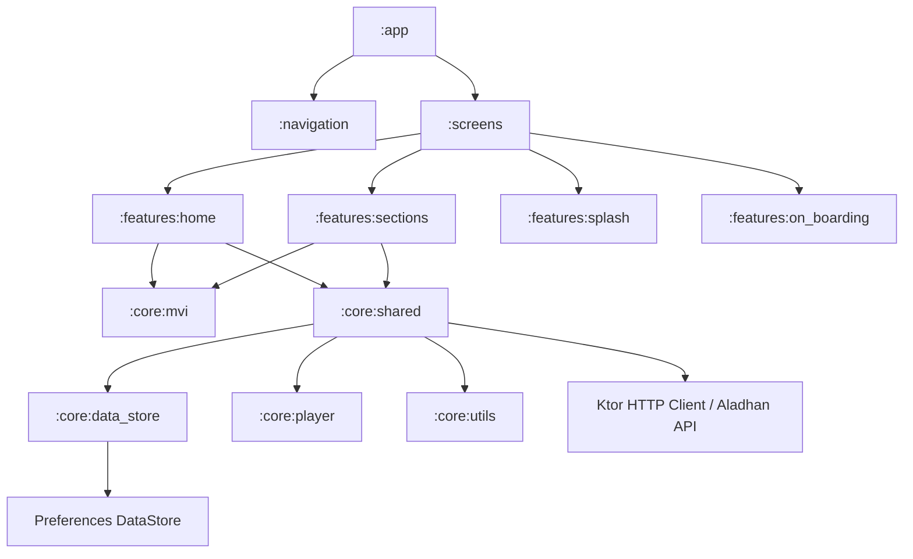

<p align="center">
  
</p>

<h1 align="center">Der3 Muslim — درع المسلم</h1>

<p align="center">
  <strong>A modern, privacy-first, feature-rich Islamic Android companion designed to enrich daily worship and spiritual connection.</strong>
</p>

<p align="center">
  <a href="https://kotlinlang.org/"></a>
  <a href="https://developer.android.com/about/versions/15"></a>
  <a href="https://developer.android.com/jetpack/compose"></a>
  <a href="https://github.com/eng-ahmed-younis/Der3-Muslim/actions"></a>
  <a href="LICENSE"></a>
</p>

---

## 📱 About Der3 Muslim (عن التطبيق)

**Der3 Muslim (درع المسلم)** is an all-in-one Islamic application engineered from the ground up using **Modern Android Development (MAD)** practices. It serves as an intuitive, ad-free, and spiritually uplifting shield for Muslims around the globe—helping users maintain daily supplications, track prayer times, find Qibla direction, practice Tasbeeh, and listen to audio recitations.

---

## 🌟 Comprehensive App Features & Deep Dive

### 1. 📖 Azkar & Supplications Library (الأذكار والأدعية)
- **Categorized Azkar Collections:**
  - **Morning & Evening Azkar (أذكار الصباح والمساء)**: Daily essential supplications with repetition counters.
  - **Sleep & Wake-up Azkar (أذكار النوم والاستيقاظ)**: Bedtime and morning remembrance.
  - **Post-Prayer Azkar (أذكار بعد الصلاة)**: Authentic supplications to read right after completing obligatory prayers.
  - **Mosque, Food, Travel & Miscellaneous Azkar (أذكار المسجد، الطعام، السفر)**: Occasional supplications for every aspect of daily life.
- **Smart Search & Arabic Normalization:**
  - Instant search across all Azkar text.
  - Built-in Arabic text normalization handling diacritics (Tashkeel) and letter variants (`أ`, `إ`, `آ`, `ة`, `ه`, `ى`, `ي`).
- **Favorites System (المفضلة):**
  - Bookmark any Zekr or supplication for instant 1-tap access directly from the home dashboard.

---

### 2. 🕌 Prayer Times & Hijri Calendar (مواقيت الصلاة والتقويم الهجري)
- **Accurate Location-Based Calculations:**
  - Real-time prayer calculation using GPS coordinates or manual location lookup powered by the **Aladhan API**.
  - Calculates Fajr, Sunrise (الشروق), Dhuhr, Asr, Maghrib, and Isha times.
- **Custom Calculation Methods:**
  - Supports international calculation authorities (Muslim World League, ISNA, Egyptian General Authority of Survey, Makkah Umm Al-Qura, University of Islamic Sciences Karachi, etc.).
- **Live Next-Prayer Countdown:**
  - Displays a dynamic real-time countdown timer showing remaining hours and minutes until the next prayer.
- **Hijri Date Integration:**
  - View current Hijri date alongside the Gregorian calendar with Islamic event highlights.

---

### 3. 🧭 Precision Qibla Compass (اتجاه القبلة)
- **Real-Time Magnetic Compass:**
  - Uses device hardware sensors (accelerometer & magnetometer) to calculate precise heading toward the Kaaba in Mecca.
- **Sensor Calibration & Visual Accuracy:**
  - Visual accuracy indicator prompting users when sensor calibration is needed for precise navigation.

---

### 4. 📿 Digital Electronic Masbaha (المسبحة الإلكترونية)
- **Interactive Counter Screen:**
  - Full-screen tap area with smooth counter progress animations.
  - Realistic **Haptic Feedback** (vibration patterns) for tactile counting without looking at the screen.
- **Target Goals & Custom Azkar:**
  - Pre-configured target goals (33, 100, or unlimited).
  - Ability to create and add custom Zekr items with personal target goals.
- **Progress Tracking & History:**
  - Records total daily Tasbeeh counts and lifetime statistics to encourage consistent daily remembrance.

---

### 5. 🔊 Audio Player Engine (المشغل الصوتي)
- **Background Audio Playback:**
  - Play audio recitations for Azkar and Quranic verses seamlessly in the background.
- **Advanced Playback Controls:**
  - Play, Pause, Seek, and Speed adjustments (0.5x, 1.0x, 1.25x, 1.5x, 2.0x).
  - Integrated Sleep Timer to auto-stop playback after a specified duration.

---

### 6. ⏰ Reminders & Notifications Engine (التنبيهات والإشعارات)
- **Local Scheduled Reminders:**
  - Set custom daily or weekly alarm notifications for specific Azkar times (e.g., Morning Azkar at 6:30 AM, Surah Al-Kahf reminder every Friday).
- **Push Notifications via Firebase (FCM):**
  - Remote push notification support powered by **Firebase Cloud Messaging** for dynamic spiritual quotes, daily tips, and updates.

---

### 7. 🗑️ Safety Recycle Bin (سلة المهملات)
- **Accidental Deletion Protection:**
  - Deleted custom Azkar or notifications are moved to a safety Recycle Bin, allowing users to easily restore or permanently delete them.

---

### 8. 🎨 Themes & Customization (التخصيص والواجهة)
- **Dynamic Dark / Light Themes:**
  - Full Material Design 3 theme system adapting automatically to system dark mode.
- **Arabic Typography & Styling:**
  - High-readability Arabic typography (Cairo font family) with adjustable font sizing.

---

## 🏗️ Architecture & Engineering Design

Der3 Muslim follows **Clean Architecture** principles combined with the **Model-View-Intent (MVI)** architectural pattern, divided across 15 modular Gradle sub-projects.

### Architecture Flow Diagram



### Module Structure & Responsibilities

| Module Name                 | Type    | Key Responsibilities                                                                              |
|:----------------------------|:--------|:--------------------------------------------------------------------------------------------------|
| **`:app`**                  | App     | Application root, Hilt DI setup (`Der3Application`), and app manifest.                            |
| **`:navigation`**           | Library | Navigation Graph definitions and type-safe screen routing.                                        |
| **`:screens`**              | Library | Composition root assembling feature composables into main screens.                                |
| **`:features:home`**        | Feature | Home dashboard, Azkar category list, search engine, and favorites.                                |
| **`:features:sections`**    | Feature | Prayer timings, Qibla compass, Masbaha counter, and custom notification scheduler.                |
| **`:features:splash`**      | Feature | Animated branding splash screen.                                                                  |
| **`:features:on_boarding`** | Feature | First-run onboarding flow and initial preference setup.                                           |
| **`:core:mvi`**             | Core    | Base framework for MVI pattern (`MviBaseViewModel`, `UiState`, `UiIntent`, `UiEffect`).           |
| **`:core:shared`**          | Core    | Domain entities, Use Cases, Repositories, Ktor API Services, DTOs, and FCM notification builders. |
| **`:core:data_store`**      | Core    | Local key-value persistence using Jetpack Preferences DataStore.                                  |
| **`:core:player`**          | Core    | Audio playback manager service for recitation streaming.                                          |
| **`:core:ui`**              | Core    | Reusable Compose UI components, Material 3 Theme, colors, strings, and icons (`der3_logo`).       |
| **`:core:ui-model`**        | Core    | Platform-agnostic UI data models, Enums, and State wrappers.                                      |
| **`:core:utils`**           | Core    | Arabic text normalization, date-time formatters, and utility extensions.                          |
| **`:buildSrc`**             | Gradle  | Centralized build dependencies, Kotlin DSL version constants (`BuildVersions.kt`), and plugins.   |

---

## 🛠️ Tech Stack & Open-Source Libraries

- **Language:** [Kotlin 2.0+](https://kotlinlang.org/)
- **UI Framework:** [Jetpack Compose](https://developer.android.com/jetpack/compose) + Material 3 Design System
- **Dependency Injection:** [Hilt (Dagger-Hilt)](https://dagger.dev/hilt/) + KSP (`symbol-processing`)
- **Async & Concurrency:** [Kotlin Coroutines](https://kotlinlang.org/docs/coroutines-overview.html) & [StateFlow / SharedFlow](https://kotlinlang.org/docs/flow.html)
- **Architecture Pattern:** Clean Architecture + MVI (Model-View-Intent)
- **Networking:** [Ktor Client 3.x](https://ktor.io/) (CIO Engine, ContentNegotiation, Kotlinx Serialization)
- **Local Storage:** [Jetpack Preferences DataStore](https://developer.android.com/topic/libraries/architecture/datastore)
- **Firebase Platform:** Firebase BoM (Analytics, Cloud Messaging, Firestore)
- **Image Rendering:** [Coil Compose](https://coil-kt.github.io/coil/)
- **Code Style & Formatting:** Ktlint & `.editorconfig`
- **CI/CD Pipeline:** [GitHub Actions](https://github.com/features/actions) with automated Ktlint check, unit testing, and Slack alerts.

---

## 🚀 Getting Started for Developers

### Prerequisites
- **Android Studio:** Ladybug (2024.2.1+) or Nightly Preview.
- **JDK:** Version 21 (Temurin JDK recommended).
- **Android SDK:** Compile SDK 36 | Min SDK 24.

### Local Setup Instructions

1. **Clone the repository:**
   ```bash
   git clone https://github.com/eng-ahmed-younis/Der3-Muslim.git
   cd Der3-Muslim
   ```

2. **Configure Local Secrets File:**
   Create a `secrets.properties` file in the root project directory (automatically ignored by Git via `.gitignore`):
   ```properties
   ALADHAN_BASE_URL=https://api.aladhan.com/v1/
   SLACK_WEBHOOK_URL=your_optional_slack_webhook_url
   ```

3. **Build the Debug APK:**
   ```bash
   ./gradlew assembleDebug
   ```

4. **Run Code Quality & Unit Tests:**
   ```bash
   # Run Ktlint code style validation
   ./gradlew ktlintCheck

   # Automatically format all Kotlin code according to .editorconfig
   ./gradlew ktlintFormat

   # Run all unit tests
   ./gradlew testDebugUnitTest
   ```

---

## 📄 License

This project is licensed under the [MIT License](LICENSE).
