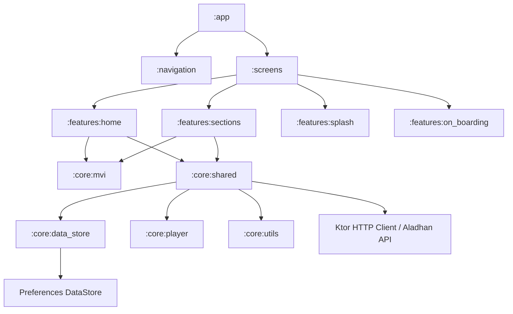

<p align="center">
  
</p>

<h1 align="center">Der3 Muslim (درع المسلم)</h1>

<p align="center">
  <strong>An Islamic Android application built with Clean Architecture, MVI, Jetpack Compose, and Kotlin Multi-Module.</strong>
</p>

<p align="center">
  <a href="https://kotlinlang.org/"></a>
  <a href="https://developer.android.com/about/versions/15"></a>
  <a href="https://developer.android.com/jetpack/compose"></a>
  <a href="https://github.com/eng-ahmed-younis/Der3-Muslim/actions"></a>
  <a href="LICENSE"></a>
</p>

---

## 📖 Overview

**Der3 Muslim (درع المسلم)** is a comprehensive, privacy-first Islamic Android application designed to serve as a daily spiritual shield and companion for Muslims. Built natively with modern Android engineering practices, it combines daily supplications (Azkar), accurate prayer timings with Hijri calendar integration, Qibla compass navigation, electronic Masbaha with haptic feedback, custom notification scheduling, and audio recitations.

---

## ✨ Key Features

### 📿 Daily Azkar & Supplications
- Extensive categorized Azkar library (Morning, Evening, Post-Prayer, Sleep, Wake-up, and Travel).
- Built-in search and normalization for fast Arabic keyword matching.
- Favorite supplications list for 1-tap quick access.

### 🕌 Accurate Prayer Times & Hijri Calendar
- Real-time prayer calculations integrated with the **Aladhan API**.
- Location-based detection and automatic calculation method adjustment.
- Visual timetable for Fajr, Sunrise, Dhuhr, Asr, Maghrib, and Isha.

### 🧭 Qibla Finder
- Real-time compass orientation pointing accurately towards Mecca (Kaaba).

### 🟤 Digital Electronic Masbaha (Tasbih)
- Interactive counter with realistic haptic feedback patterns.
- Custom target goal counters and detailed history tracking.
- Pre-loaded and custom Zekr items.

### 🔊 Audio Player & Recitations
- Embedded background audio player for Quranic recitations and audio supplications.
- Playback controls with speed toggles and period timers.

### ⏰ Custom Reminders & Notifications
- Flexible reminder engine with custom recurrence schedules.
- Integrated with **Firebase Cloud Messaging (FCM)** for remote notifications.

### 🗑️ Recycle Bin & Recovery
- Safety recycle bin for custom Azkar and deleted user reminders to allow accidental deletion recovery.

---

## 🏗️ Architecture & Modules

The application is engineered using **Clean Architecture** principles and **Model-View-Intent (MVI)** design pattern, structured across isolated, feature-driven Gradle sub-projects.

### High-Level Architecture Diagram



### Module Breakdown

| Module | Type | Description |
| :--- | :--- | :--- |
| **`:app`** | App | Application entry point, Hilt dependency injection initialization, and app manifest. |
| **`:navigation`** | Library | Centralized Jetpack Compose Navigation logic and deep link routing. |
| **`:screens`** | Library | Composition root assembling features into primary screen composables. |
| **`:features:home`** | Feature | Home dashboard, quick Azkar access, search, and daily summary widgets. |
| **`:features:sections`** | Feature | Prayer times, Qibla compass, Masbaha counter, and custom notification management. |
| **`:features:splash`** | Feature | Animated splash screen. |
| **`:features:on_boarding`** | Feature | Initial app setup flow and user preference initialization. |
| **`:core:mvi`** | Core | Base MVI ViewModel, State, Intent, and Effect interfaces. |
| **`:core:shared`** | Core | Domain & Data layers, Ktor API services, DTOs, Mappers, Use Cases, and Repositories. |
| **`:core:data_store`** | Core | Jetpack Preferences DataStore implementation for local settings and persistence. |
| **`:core:player`** | Core | ExoPlayer / Media player wrapper service for audio recitations. |
| **`:core:ui`** | Core | Design System, Material 3 Theme, Typography, Reusable Composable Components, and Resources. |
| **`:core:ui-model`** | Core | Platform-agnostic UI models and Enums. |
| **`:core:utils`** | Core | Utility extensions, Arabic text normalization, and date-time formatters. |
| **`:buildSrc`** | Gradle | Centralized build dependencies, Kotlin DSL versions (`BuildVersions.kt`), and shared plugins. |

---

## 🛠️ Tech Stack & Dependencies

- **Language:** [Kotlin 2.0+](https://kotlinlang.org/)
- **UI Framework:** [Jetpack Compose](https://developer.android.com/jetpack/compose) with Material Design 3
- **Dependency Injection:** [Hilt (Dagger-Hilt)](https://dagger.dev/hilt/) + KSP
- **Asynchronous & Reactive Streams:** [Kotlin Coroutines](https://kotlinlang.org/docs/coroutines-overview.html) & [StateFlow / SharedFlow](https://kotlinlang.org/docs/flow.html)
- **Architecture:** Clean Architecture + MVI (Model-View-Intent)
- **Networking:** [Ktor Client 3.x](https://ktor.io/) (CIO engine, ContentNegotiation, Kotlinx Serialization)
- **Local Persistence:** [Jetpack Preferences DataStore](https://developer.android.com/topic/libraries/architecture/datastore)
- **Firebase Services:** Firebase BoM (Analytics, Cloud Messaging, Firestore)
- **Image Loading:** [Coil Compose](https://coil-kt.github.io/coil/)
- **Code Style & Formatting:** Ktlint & `.editorconfig`
- **CI/CD:** [GitHub Actions](https://github.com/features/actions) with automated linting, unit testing, and Slack build status notifications

---

## 🚀 Getting Started

### Prerequisites
- **Android Studio:** Ladybug (2024.2.1+) or Nightly Preview.
- **JDK:** Version 21 (Temurin JDK recommended).
- **Compile SDK:** 36 | **Min SDK:** 24.

### Local Setup Instructions

1. **Clone the repository:**
   ```bash
   git clone https://github.com/eng-ahmed-younis/Der3-Muslim.git
   cd Der3-Muslim
   ```

2. **Configure Secrets / Properties:**
   Create a `secrets.properties` file in the root project directory (automatically ignored by Git):
   ```properties
   ALADHAN_BASE_URL=https://api.aladhan.com/v1/
   SLACK_WEBHOOK_URL=your_optional_slack_webhook_url
   ```

3. **Build the Project:**
   ```bash
   ./gradlew assembleDebug
   ```

4. **Run Unit Tests & Code Style Check:**
   ```bash
   # Run Ktlint code style validation
   ./gradlew ktlintCheck

   # Automatically format code according to .editorconfig
   ./gradlew ktlintFormat

   # Run all unit tests
   ./gradlew testDebugUnitTest
   ```

---

## 🧪 CI/CD Pipeline

The project includes pre-configured **GitHub Actions** workflows:
- **`ci.yml`**: Automatically triggers on `push` or `pull_request` to `master`, `develop`, and `ci_cd` branches. It runs:
  1. JDK 21 Environment Setup
  2. Ktlint Code Style Check (`./gradlew ktlintCheck`)
  3. Unit Tests (`./gradlew testDebugUnitTest`)
  4. Debug / Staging / Release Build Assembly (`./gradlew assembleDebug`)
  5. Test Reports Artifact Upload
  6. Real-time Slack Status Notifications
- **`manual_unit_tests.yml`**: Manual trigger workflow (`workflow_dispatch`) to execute unit tests for specific modules/features or environments.

---

## 📄 License

This project is licensed under the [MIT License](LICENSE).
